# Uso do NIFI

## Objetivo
Explicar o uso básico da ferramenta por meio de exemplos. Importante notar que o Apache NiFi possui muitos outros usos além dos descritos aqui e este tutorial busca tornar o leitor apto a entender por si só o uso geral da ferramenta.

## Links
[1] https://nifi.apache.org/docs/nifi-docs/html/expression-language-guide.html  
[2] https://community.cloudera.com/t5/Support-Questions/InvokeHTTP-with-pagination/td-p/165546?lightbox-message-images-165546=20375i893A220D11974D6F  
[3] https://github.com/pvillard31/my-blog/blob/main/2016/2016-04-04-analyze-flickr-account-using-apache/index.md  
[4] https://shubham-kanungo95.medium.com/exploring-nifi-rest-api-with-stopping-and-starting-a-processor-cfeac9073c1c  
[5] https://nifi.apache.org/docs/nifi-docs/rest-api/index.html
## Dependências
[1] Nifi, 1.25.0, Controle de fluxo de dados

##  Controladores de Serviço
Ao clicar no símbolo de engrenagem na aba de Operate será aberta a aba de configuração do Flow do Apache NiFi. 

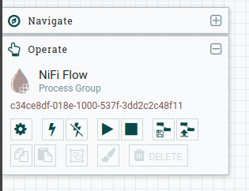

Nesta aba é possível adicionar e configurar controladores de serviço ao NiFi. Exemplo de controladores são o DBCPConnectionPool para conectar-se a um BD(para mais informações sobre como conectar um banco conferir arquivo Nifi-clickhouse.md neste mesmo diretório) e o JsonTreeReader e JsonRecordSetWriter cujas funções são respectivamente ler e escrever um arquivo Json.
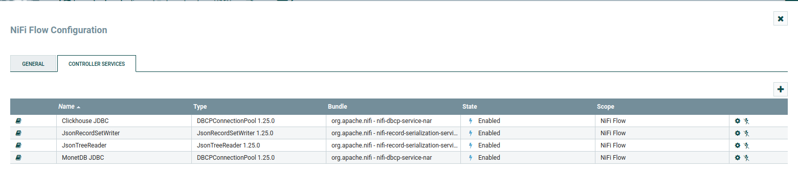
 
##  Processadores 

Os Processadores são os componentes mais importantes da ferramenta. Eles são responsáveis por de fato realizar as ações como por exemplo executar consultas SQL, fazer requisições HTTP, ler arquivos CSV ou JSON e até mesmo efeutar Merge de vários arquivos JSON em um só.

####    Exemplos de processadores
#####   GenerateFlowFile
Este processador tem a função de gerar um arquivo de fluxo que pode conter atributos para a operação de outros processadores. Para adicionar atributos ao arquivo clique no símbolo de + no canto superior direito. Conferir caso de uso "Requisição HTTP Iterada".  

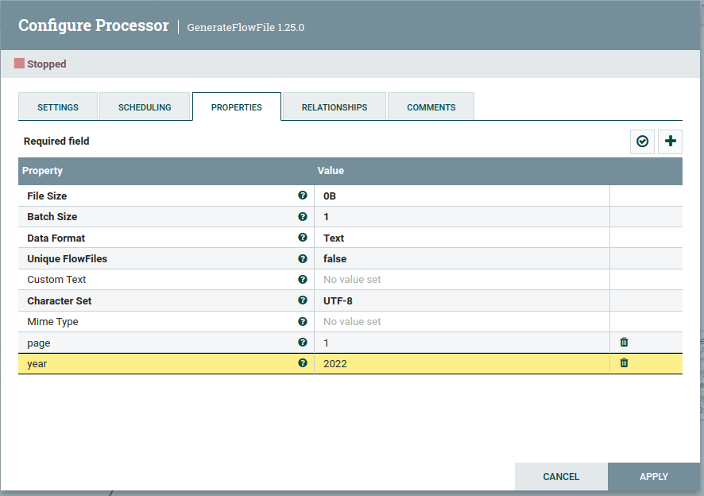

#####   UpdateAttribute
Este processador tem a função de atualizar os atributos de um arquivo de fluxo. Conferir caso de uso "Requisição HTTP Iterada".  

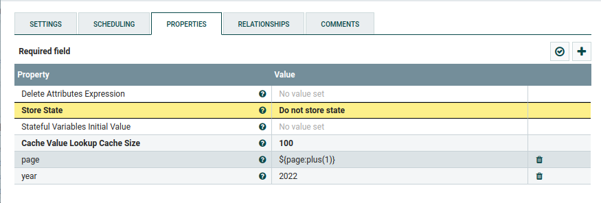

#####   ExecuteSQL
Este processador tem a função de executar consultas SQL em um banco de dados. O campo Database Connection Pooling Service referencia o BD ao qual será conectado e o campo SQL select query deve conter a query a ser executada.  

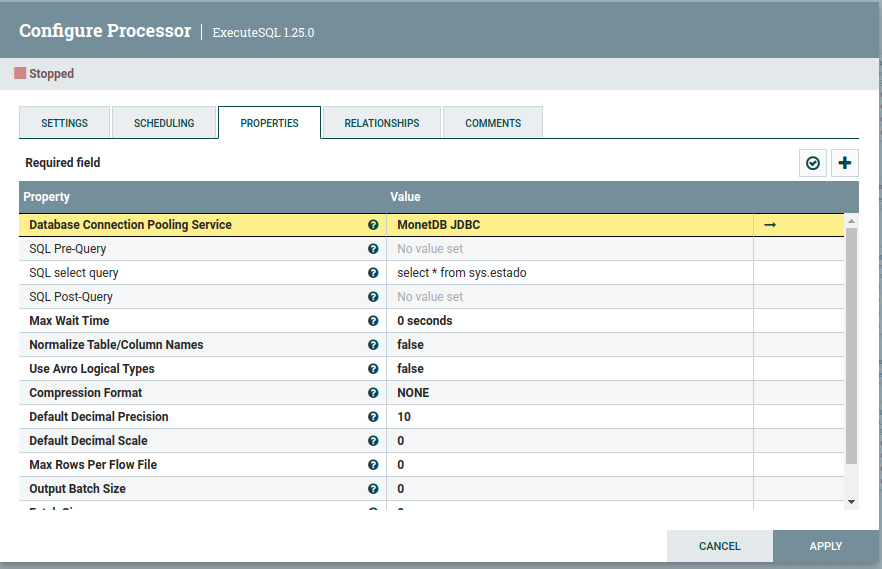
  

IMPORTANTE: Este processador retorna um arquivo no formato Avro. A saída deve ser conectada a um processador ConvertAvroToJSON para poder ser melhor utilizada. Conferir caso de uso "Leitura e Escrita em BD".

#####   PutDatabaseRecord
Este processador tem a função de executar querys de UPDATE,INSERT,UPSERT,INSERT_IGNORE e DELETE no BD conectado.O campo Database Connection Pooling Service referencia o BD ao qual será conectado, já os nomes dos outros campos são auto explicativos. Conferir caso de uso "Leitura e Escrita em BD"

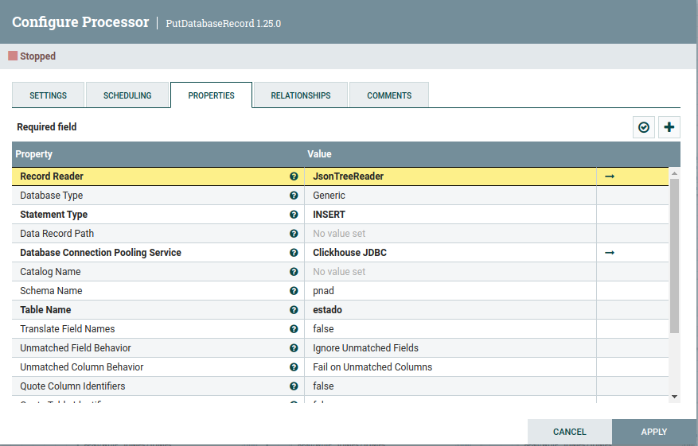

#####   InvokeHTTP
Este processador tem a função de executar requisições HTTP. É possível adicionar campos ao Header da requisição clicando no símbolo de + no canto superior direito. Conferir caso de uso "Requisição HTTP Iterada"

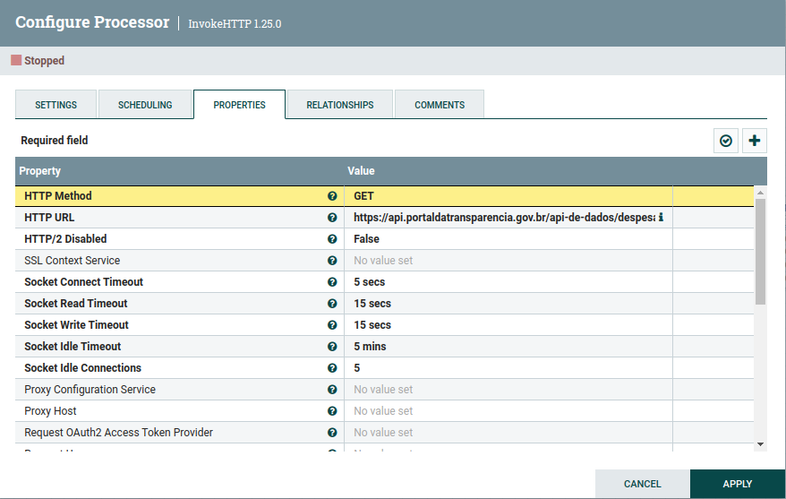

##  Filas e Relações
Os processadores possuem relações as quais indicam o que devem fazer com os arquivos de fluxo gerados ou recebidos. Todas as relalções de um processador devem ser satisfeitas para que seu uso seja possível. Caso não haja função externa para uma relação é possível internamente resolve-la ou gerar um retry caso visto necessário

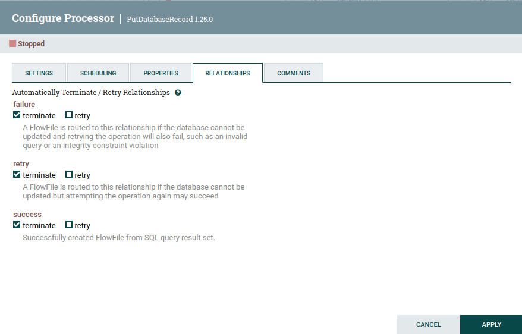

As filas são parte crucial do funcionamento da ferramenta por guardarem os arquivos de fluxo. Exemplos de filas: 

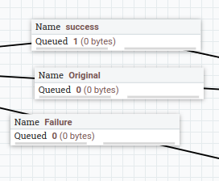

### Sucesso
Guarda a saída do processador no caso de sucesso da operação. Exemplo: Um processador ExecuteSQL irá enviar para esta fila o resultado da consulta caso tudo ocorra sem problemas.

### Original
Guarda o arquivo de entrada que foi usado para a execução de um processador. Exemplo: Caso seja usado um arquivo de fluxo para a execução de um processador InvokeHTTP,o mesmo será retransmitido sem mudanças para a fila Original para possíveis reusos futuros ou alterações. 

##  Casos de Uso
### Leitura e Escrita em BD
Vamos analisar o caso de uso da leitura da tabela Regiao de um MonetDB e sua reescrita em um Clickhouse:  
Primeiramente a tabela foi recriada manualmente (acredita-se ser possível recriar uma tabela por meio do NiFi caso o BD forneça possibilidade de consulta do statement de create table da tabela, no caso do MonetDB isso não foi possível).

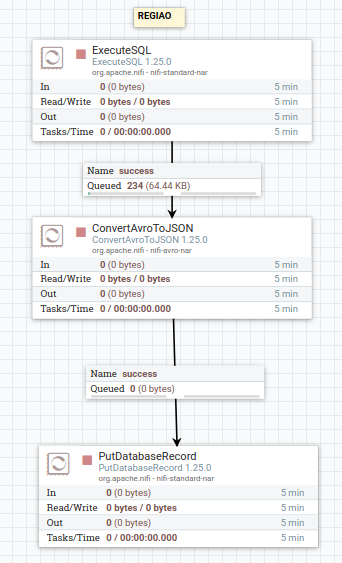

Então foi realizada a query de leitura do MonetDB no processador ExecuteSQL (Os outros campos não foram alterados)

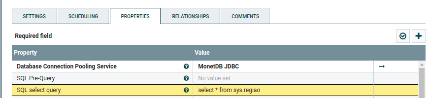

O resultado da query foi enviado à fila de sucesso e então recebida pelo processador ConvertAvroToJSON. Após isso o arquivo de fluxo foi enviado ao processador PutDatabaseRecord para ser escrito no ClickHouse. (Os outros campos não foram alterados)

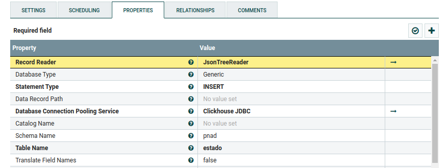

### Requisição HTTP Iterada
O objetivo deste caso de uso foi de realizar um GET HTTP e iterar sobre a paginação da API.

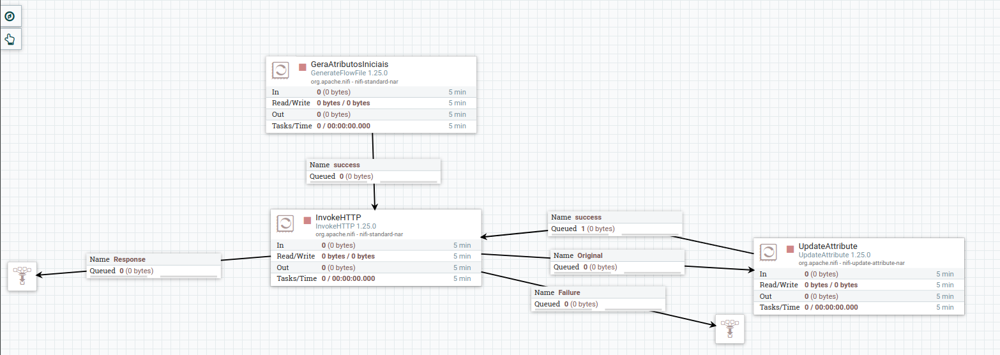

Inicialmente vamos manter em mente que existem 2 campos de argumentos (ano e pagina) e 2 campos de Header (accept e chave-api-dados) na requisição (O campo de chave foi apagado por questões de segurança):

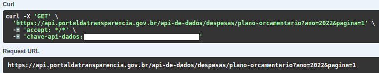

Dessa forma foi criado um GenerateFlowFile com os argumentos page e year com o ano de 2022 e a página 1 como valores iniciais.

Após isso o arquivo de fluxo foi enviado ao processador InvokeHTTP para ser realizada a consulta:

No campo HTTP URL foi escrito: https://api.portaldatransparencia.gov.br/api-de-dados/despesas/plano-orcamentario?ano=${year}&pagina=${page} para fazer uso dos argumentos de entrada contidos no arquivo de fluxo.
Foram também criados os campos de header accept e chave-api-dados clicando no ícone de + no canto superior direito.(Mais uma vez o campo de chave foi apagado por questões de segurança)

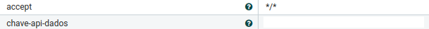

O retorno da requisição foi enviado para a fila Response e o arquivo de fluxo anteriormente criado com os valores inicias foi enviado para a fila Original que foi utilizado pelo processador UpdateAttribute para atualizar o campo page somando 1 a ele por meio do método plus para que uma nova requisição seja realizada nesta nova página concluindo assim o processo de iteração.

## Linguagem de Expressão
A ferramenta possui a capacidade de efetuar várias operações em cima dos argumentos como manipulações de String e operações booleanas ou aritméticas. Por haverem muitos casos de uso possíveis recomenda-se conferir a documentação oficial do Apache NiFi: https://nifi.apache.org/docs/nifi-docs/html/expression-language-guide.html

##  Outros Componentes

###  Funil 

A função dos funis é reunir várias relações em uma só para simplificar o fluxo de dados entre processadores. O exemplo a seguir poderia ser simplificado conectando as 3 filas a um funil e então conectando-o ao processador LogAttribute, caso seja desejado trocar o processador ao qual as filas estão conectadas será necessário efetuar a troca apenas de uma relação (funil e processador) ao invés de trocar 3 relações como mostrado.  
Também é possível utilizar um funil como dump de arquivos de fluxo.

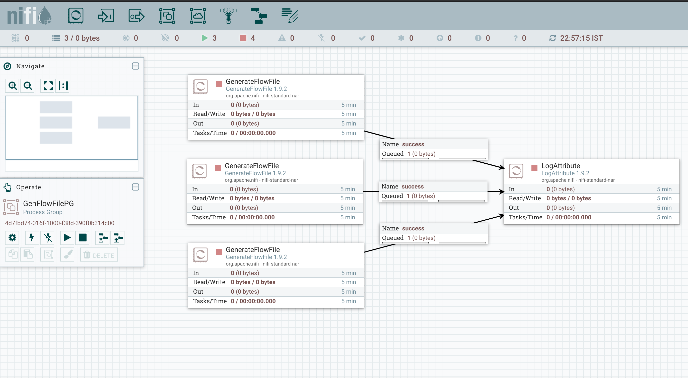

###  Template
Os templates permitem salvar conjuntos de processadores. Ao segurar Shift e clicar e arrastar o botão esquerdo é possível criar uma caixa para selecionar vários componentes e então clicar com o botão direito é possível transformar esse grupo em um template para usos futuros.  
Para gerenciar e baixar um template vá no menu no canto superior direito e selecione "Templates":

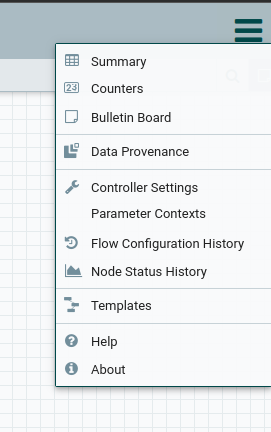                 

A lixeira apaga o template e o símbolo da esquerda faz o download do Template:

Para fazer upload de um template em outro NiFi clique com o botão direito em qualquer lugar do fundo do NiFi para abrir o menu e vá em "upload Template":

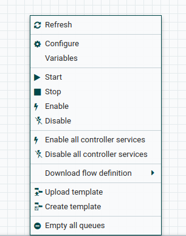

###  Rótulo(Label)
A função do Rótulo é criar campos de texto para usos genéricos como comentários ou nomeação de um conjunto de processadores como no exemplo a seguir que foi utilizado para avisar o nome da tabela sob a qual cada operação está sendo efetuada:

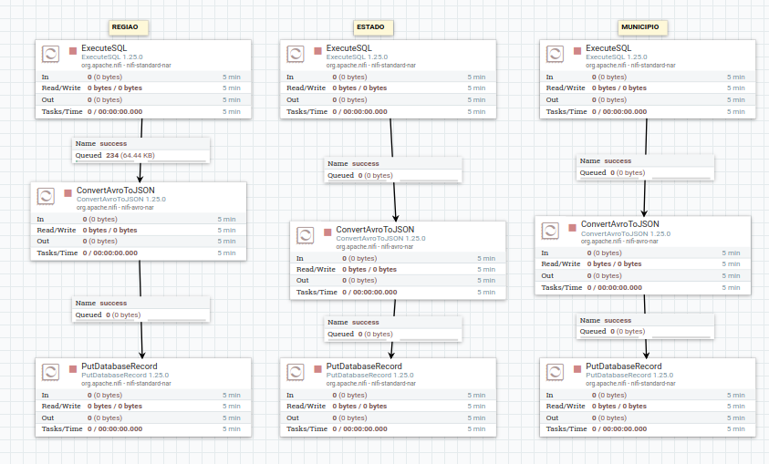

##  TUTORIAIS FUTUROS
[1] É possível fazer start e stop de processadores por requisiçẽos API:   
https://shubham-kanungo95.medium.com/exploring-nifi-rest-api-with-stopping-and-starting-a-processor-cfeac9073c1c  
https://nifi.apache.org/docs/nifi-docs/rest-api/index.html  
[2] Uso de lógica booleana
